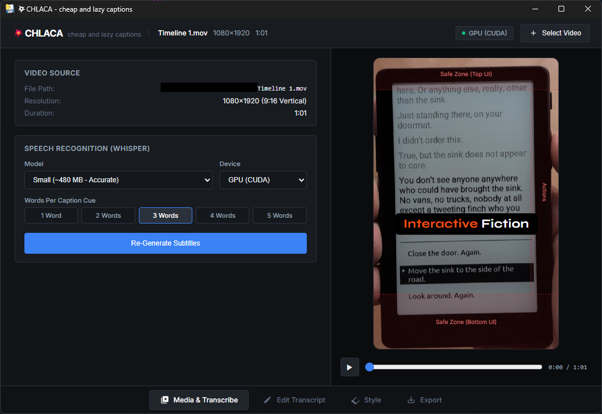
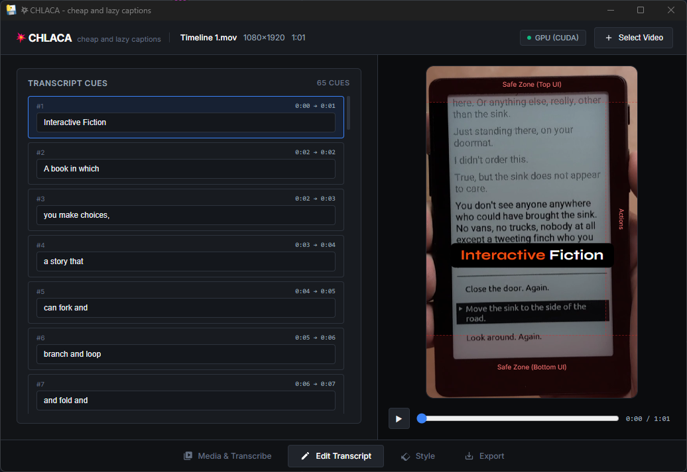
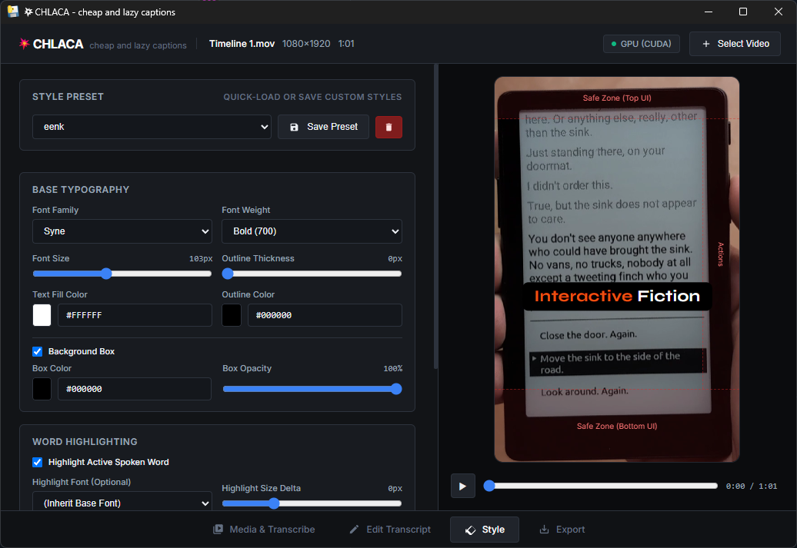
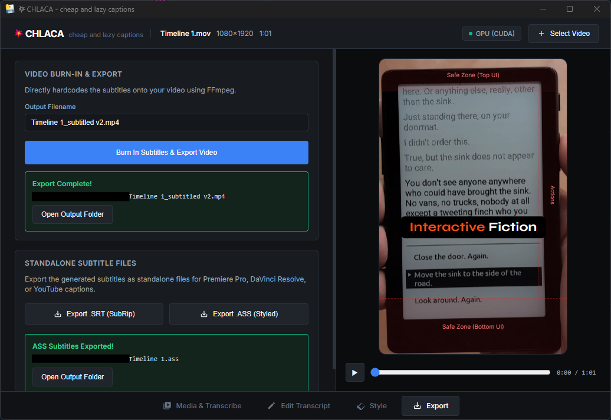

# 💥CHLACA
### *CHeap & LAzy CAptions for vertical video*

[](LICENSE)
[](https://python.org)
[](#)
[](#)

> **"BOOM! CHLACA"** is a fast, lightweight desktop tool for adding captions to vertical **YouTube Shorts, TikTok, and Instagram Reels (9:16)**.

(although horizontal videos are supported too, and you can export discrete `.srt` or `.ass` instead of burning them in). 
 
- Transcribe speech locally on your GPU/CPU with **open-weight AI models**
- Customize high-energy **animated word highlights & background boxes** in a live 60fps preview player
- **Burn them directly into your video** with hardware-accelerated FFmpeg. No cloud subscriptions, no subscriptions fees, no complex NLE macro templates.

> [!CAUTION]
> I vibe coded this tool with absolutely zero oversight, but it fullfilled my need perfectly in minutes after a couple of hours wasted on searching for captioning tools with word animation that aren't paywalled, watermarked, require an account, or all of the above. 
> 
> This disclaimer is basically the only human written thing in this whole forking repo, but I figured, since CHLACA works great and the tokens have been burnt, I might put it here and it might help others out. Do not expect any maintenance tho :) Cheers.

---

## ⚡ Direct Download (No Python or Setup Required)

If you just want to use the application, grab the pre-packaged portable build:

📥 **[Download Latest CHLACA Portable (Windows x64)](https://github.com/your-username/chlaca/releases/latest)** (`CHLACA-portable-windows-x64.zip`)

- **Zero install**: Unzip anywhere and launch `CHLACA.exe`.
- **Completely self-contained**: Includes embedded FFmpeg, Silero VAD speech detector, and NVIDIA CUDA 12 runtime libraries for instant out-of-the-box GPU acceleration.

---

## 📸 Workflow & Screenshots

### 1. Media & Transcription
Import any video file, select your speech recognition model (`tiny` up to `large-v3-turbo`), choose CPU or GPU (CUDA), and set your desired words per cue (1 to 5 words).


### 2. Live Transcript Review
Edit caption text inline with instant keystroke-by-keystroke preview updates. Emptying a cue automatically merges timing into the preceding caption without leaving gaps or blank boxes.


### 3. Typography, Highlights & Presets
Pick from curated style presets (*Default Shorts*, *Syne ExtraBold Box*, *Neon Green Stroke*, *Cyber Cyan*, *Clean Minimal*) or save your own. Customize font family, weight, base size (up to 220px), relative highlight size delta, and rounded background boxes with opacity control.


### 4. Direct Video Burn-In & Subtitle Export
One-click burn-in uses hardware-accelerated FFmpeg (`h264_nvenc` / `libx264`) with `libass` to hardcode pixel-perfect subtitles directly into an MP4 video, or export clean standalone `.srt` and `.ass` files.


---

## 🌟 Features

- 🎙️ **100% On-Device & Private**: Powered by `faster-whisper` and CTranslate2. Models are downloaded directly from Hugging Face hub once and cached locally. Your audio and video never leave your machine.
- ⚡ **NVIDIA CUDA 12 GPU Acceleration**: Auto-detects NVIDIA GPUs (e.g. RTX series) for lightning-fast transcription with automatic multithreaded CPU fallback.
- 📱 **Designed for 9:16 Vertical Video**:
  - Horizontal text auto-centering with DirectWrite & GDI font metrics.
  - Vertical position slider (15% to 88%) with a one-click **YouTube Shorts / TikTok Safe Zone preset (72%)**.
  - Interactive Safe Area Overlay simulating platform UI buttons, usernames, and audio tags.
- 🔤 **Complete Typography Freedom**:
  - Full access to installed Windows system fonts plus popular curated video fonts (Montserrat, Syne, Anton, Bebas Neue, Poppins, etc.).
  - Automatic download and registration of static extra-bold weights for variable fonts.
- ✨ **Animated Word Highlighting**:
  - Word-level timestamps provide continuous, flicker-free spoken word tracking.
  - **Highlight Size Delta**: Adjust highlight emphasis relative to base font size without breaking proportions when resizing.
  - Optional subtle pop/scale bounce effect on active spoken words.
  - Rounded vector pill background boxes with opacity control.
- 💾 **Preset Management**:
  - Save custom typography presets persisted across restarts in `~/.chlaca/presets.json`.
- 📦 **Dual Export**:
  - Export hardcoded subtitled MP4 with hardware acceleration.
  - Export standalone `.srt` (SubRip) and styled `.ass` (Advanced SubStation Alpha) for Premiere Pro, DaVinci Resolve, or YouTube captions.

---

## 🛠️ Developer Setup / Building from Source

### Prerequisites
- **Python 3.10+** (64-bit recommended)
- **FFmpeg** on system `PATH` (with `libass` support).
  ```powershell
  winget install Gyan.FFmpeg
  ```
- **Windows 10 / 11** with Microsoft Edge WebView2 runtime (preinstalled on modern Windows).

### 1. Clone the Repository
```bash
git clone https://github.com/t0mg/CHLACA.git
cd CHLACA
```

### 2. Install Dependencies
You can install dependencies using either `pip` or `uv`:

```bash
# Using standard pip with pyproject.toml
python -m venv .venv
.\.venv\Scripts\activate
pip install -e .

# Or for NVIDIA GPU acceleration (CUDA 12 runtimes):
pip install -e ".[gpu]"

# Alternatively, using requirements.txt:
pip install -r requirements.txt
pip install -r requirements-gpu.txt
```

### 3. Launch CHLACA
```bash
python run_chlaca.py
```
*(Or run `chlaca` directly if installed in editable mode).*

---

## 🧪 Running Tests

The test suite covers ASS subtitle vector generation, token alignment, SRT export, chunking, FFmpeg burn-in, CUDA detection, and preset persistence:

```bash
pytest tests/ -v
```

All 35 unit and integration tests run against isolated test fixtures in `tests/fixtures/`.

---

## 📦 Building Standalone Portable Release

To package CHLACA into a self-contained portable directory and ZIP distribution:

```bash
# Build standalone directory and compress into a portable ZIP:
python packaging/build_windows.py --zip
```

This automated build script:
1. Runs PyInstaller with all required hidden imports and WebView assets.
2. Locates and bundles system `ffmpeg.exe` and `ffprobe.exe`.
3. Copies NVIDIA CUDA 12 runtime DLLs (`cublas`, `cudnn`, `nvrtc`).
4. Bundles `faster-whisper` Silero VAD ONNX models.
5. Ingests documentation (`README.txt`, `LICENSE`, `THIRD_PARTY_LICENSES.txt`).
6. Creates `dist/CHLACA-portable-windows-x64.zip` ready for release distribution.

*(Optional)* To compile a single-file setup installer executable, install [Inno Setup](https://jrsoftware.org/isinfo.php) (`winget install JRSoftware.InnoSetup`) and run:
```bash
python packaging/build_windows.py
```

---

## 🏛️ Architecture

```
CHLACA/
├── piccut/                     # Core application package
│   ├── app.py                  # PyWebView desktop launcher & Bottle streaming server
│   ├── api.py                  # PyWebView JavaScript <-> Python bridge API
│   ├── transcriber.py          # faster-whisper on-device transcription engine
│   ├── chunker.py              # Word chunker with pause and punctuation heuristics
│   ├── ass_generator.py        # Pixel-perfect ASS subtitle vector path generator
│   ├── burn_in.py              # Hardware-accelerated FFmpeg burn-in engine
│   ├── font_manager.py         # TrueType font weight resolution & GDI registration
│   ├── presets.py              # Style preset manager and disk persistence
│   └── gui/
│       └── index.html          # Modern studio dark GUI with 60fps live canvas preview
├── docs/
│   └── screenshots/            # UI walkthrough screenshots
├── packaging/
│   ├── build_windows.py        # Automated PyInstaller & portable zip packager
│   └── CHLACA_installer.iss    # Inno Setup single-installer script
├── tests/
│   ├── fixtures/               # Lightweight test video & audio fixtures
│   └── test_*.py               # 35 comprehensive unit/integration tests
├── pyproject.toml              # Standard PEP 517/518/621 package specification
├── requirements.txt            # Core runtime dependencies
├── requirements-gpu.txt        # CUDA 12 runtime dependencies
├── LICENSE                     # MIT License
└── THIRD_PARTY_LICENSES.txt    # Open-source third-party notices
```

---

## 📄 License & Acknowledgments

- Released under the [MIT License](LICENSE).
- Powered by open-source technologies: [faster-whisper](https://github.com/SYSTRAN/faster-whisper), [CTranslate2](https://github.com/OpenNMT/CTranslate2), [pywebview](https://pywebview.flowrl.com/), [FFmpeg](https://ffmpeg.org/), and [Bottle](https://bottlepy.org/).
- Complete copyright notices and licenses for all included components are documented in [THIRD_PARTY_LICENSES.txt](THIRD_PARTY_LICENSES.txt).
